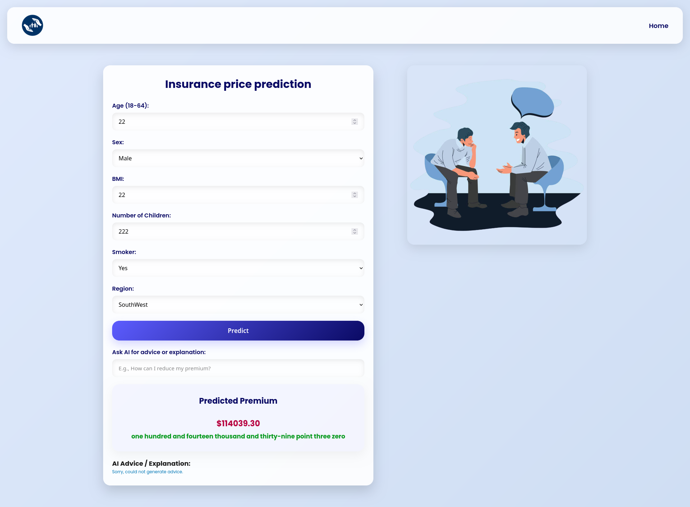

# 🚀 CoverCast AI with MLOps & CI/CD

[](https://www.python.org/downloads/)
[](https://flask.palletsprojects.com/)
[](https://scikit-learn.org/stable/)
[](https://github.com/YogeshKumar-saini/covercast-ai-app.git)

This project predicts health insurance premiums using demographic and health-related features. It integrates **MLOps best practices** with CI/CD for continuous training, testing, and deployment.

---

## 💻 Live Demo

Try the live application:
**[insurance-premium-price-prediction.onrender.com](http://ec2-13-62-45-61.eu-north-1.compute.amazonaws.com:5000/)**

Demo GIF:


---

## ✨ Key Features

* **Predictive Model:** CatBoost Regressor with **R² = 0.88** for accurate predictions.
* **End-to-End ML Pipeline:** Data ingestion → validation → feature engineering → model training → evaluation.
* **CI/CD Integration:** Automatic testing, building, and deployment with GitHub Actions.
* **Containerized Deployment:** Dockerized for consistency; deployed on AWS EC2.
* **Data Versioning:** Full dataset and model tracking via **DVC**.
* **Interactive Web Interface:** Built with Flask, HTML, and CSS for user-friendly interactions.

---

## 🏗️ MLOps Architecture

### Level 1: Continuous Training (CT)

The ML pipeline supports automated retraining whenever new data is added, ensuring that the production model is always up-to-date. Key components:

* Automated **data validation**
* Automated **model validation**
* **Pipeline triggers** for retraining
* **Metadata management** for versioning


---

### Level 2: CI/CD Pipeline

CI/CD ensures the project is **rapidly deployable and maintainable**. Any code or model updates automatically trigger:

1. Unit and integration tests
2. Build of Docker image
3. Deployment to AWS EC2 or Render

---

## 📊 Dataset Overview

* **Source:** [Kaggle Insurance Premium Prediction Dataset](https://www.kaggle.com/noordeen/insurance-premium-prediction)
* **Features:** age, sex, bmi, children, smoker, region
* **Target:** insurance charges (premium)
* **Preprocessing:** Missing value handling, one-hot encoding for categorical variables, feature scaling

---

## 🧮 Model Evaluation

| Model                   | R² Score | RMSE     |
| ----------------------- | -------- | -------- |
| CatBoost Regressor      | 0.88     | 3200 USD |
| Random Forest Regressor | 0.85     | 3500 USD |
| Linear Regression       | 0.78     | 4500 USD |

> CatBoost was chosen for its **high performance** and **robustness** to categorical features.

---

## 🛠️ Tech Stack

* **Backend:** Flask
* **Frontend:** HTML, CSS
* **ML:** CatBoost, Scikit-learn
* **MLOps:** DVC, MLflow
* **CI/CD:** GitHub Actions, Tox
* **Testing:** Pytest
* **Deployment:** Docker, AWS EC2, Render

---

## ⚙️ System Requirements

* Python 3.8+
* Git
* Conda / Miniconda
* Docker
* DVC (optional but recommended for full MLOps experience)

---

## 🚀 Getting Started (Local Setup)

### Clone the Repo

```bash
git clone https://github.com/YogeshKumar-saini/CoverCast-AI.git
cd CoverCast-AI
```

### Create & Activate Conda Environment

```bash
conda create -p venv python=3.8 -y
conda activate venv/
```

### Install Dependencies

```bash
pip install -r requirements.txt
```

### Setup Environment Variables

```bash
cp .env.example .env
# Edit .env and add your Gemini API key
```

### Run Flask Application

```bash
python app.py
```

Visit `http://127.0.0.1:8080` in your browser.

---

## 🌐 Deployment Options

### Quick Deployment (Recommended)

**🎯 Render (Easiest & Free)**
```bash
# 1. Push to GitHub
git add .
git commit -m "Ready for deployment"
git push origin main

# 2. Deploy on Render
# Visit https://render.com, connect GitHub, and deploy!
# Add API_KEY environment variable in Render dashboard
```

**Alternative Platforms:**
- **Railway** - Quick setup, $5 monthly credit
- **PythonAnywhere** - Python-specific, simple interface
- **Vercel** - Serverless, good for global CDN

### Deployment Preparation

Run the deployment helper script:
```bash
./deploy.sh
```

This script checks:
- ✅ Environment variables (.env file)
- ✅ Model file (saved_models/model_pipeline.joblib)
- ✅ Dependencies (requirements.txt)

### Files Created for Deployment

- `render.yaml` - Render platform configuration
- `Procfile` - Heroku-style process definition
- `.env.example` - Environment variables template
- `requirements.txt` - Python dependencies
- `DEPLOYMENT_GUIDE.md` - Detailed deployment instructions

📖 **See [DEPLOYMENT_GUIDE.md](DEPLOYMENT_GUIDE.md) for complete deployment instructions**

---

## 🔄 Workflow

1. Update `config.yaml` for paths & settings
2. Adjust `params.yaml` for model hyperparameters
3. Modify `entity` definitions if needed
4. Update configuration manager (`configuration.py`)
5. Edit pipeline components (`src/components`)
6. Modify `pipeline` sequence
7. Update `main.py` to run the training pipeline
8. Adjust `app.py` for deployment changes

---

## 🧪 Testing

* **Run Pytest**

```bash
pytest -v
```

* **Run Tox Tests**

```bash
tox
```

* **Force rebuild Tox environment**

```bash
tox -r
```

* **DVC Operations**

```bash
dvc repro          # Reproduce full pipeline
dvc metrics show    # View model metrics
```

---

## 📁 Project Structure

```
├── LICENSE
├── README.md
├── data
│   ├── raw
│   └── processed
├── models
├── notebooks
├── requirements.txt
├── setup.py
├── src
│   ├── __init__.py
│   ├── components
│   ├── config
│   ├── constants
│   ├── entity
│   ├── pipeline
│   ├── utils
│   └── logging
├── app.py
├── main.py
└── tox.ini
```

> Structure follows **Cookiecutter Data Science** template.

---

## 🤝 Contributing

Contributions are welcome! Fork → branch → commit → PR → review.

---

## 📜 License

MIT License. See [LICENSE](https://opensource.org/licenses/MIT) for details.

---

## 📧 Contact

Email: [yksaini1090@gmail.com](mailto:yksaini1090@gmail.com)

---

This enhanced version includes:

* Badges for Python, Flask, Scikit-learn, license, and CI/CD
* Dataset overview & model evaluation table
* Detailed workflow of project
* Clear MLOps architecture & CI/CD description
* System requirements

---
